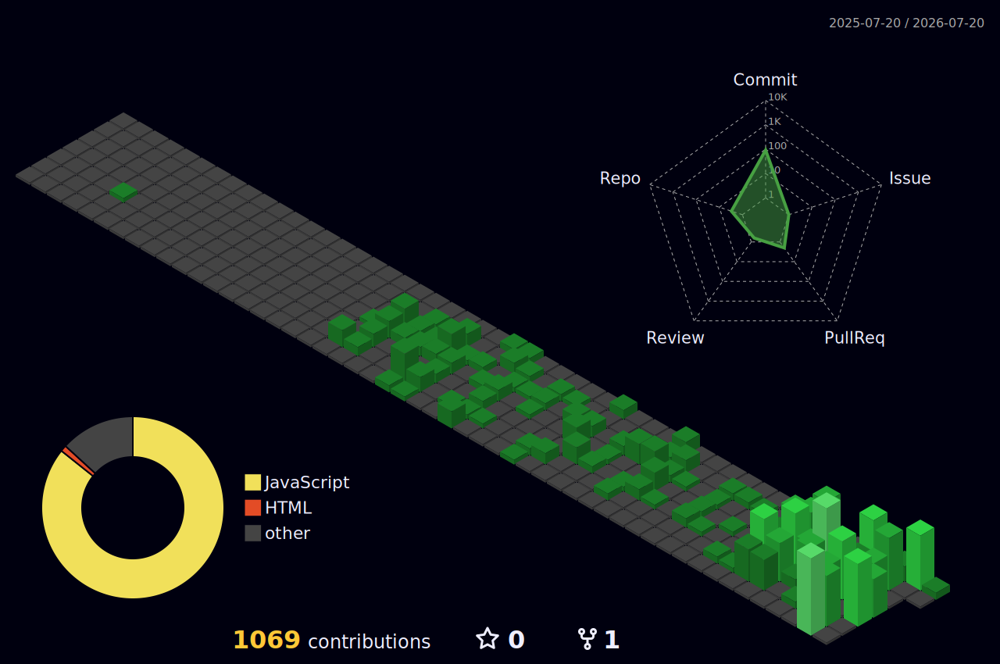
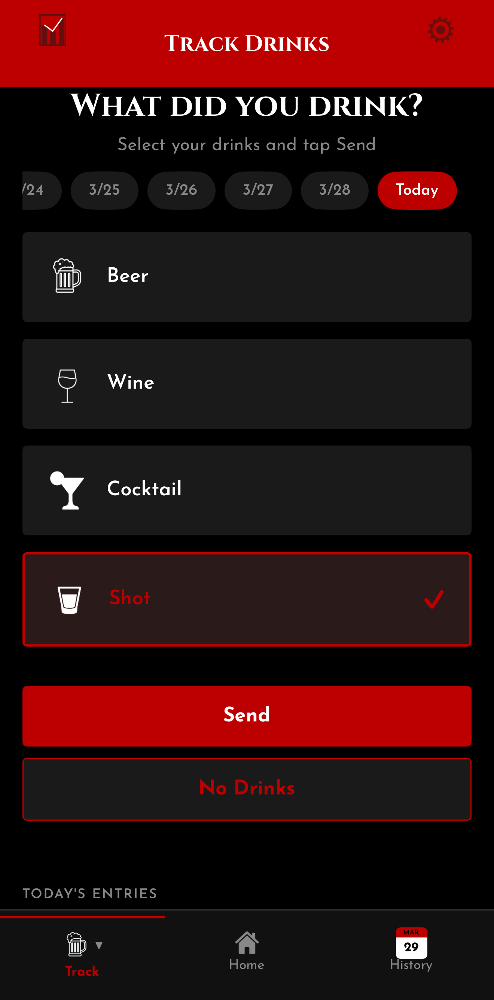
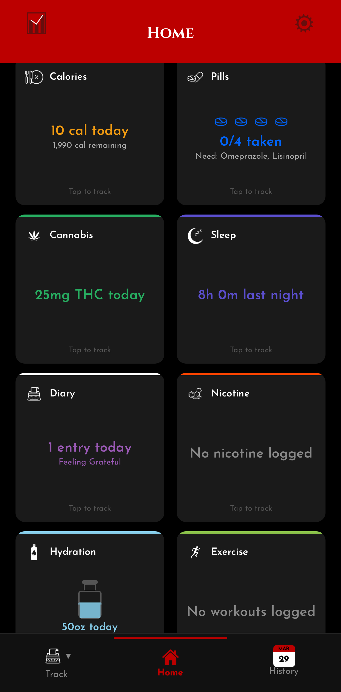
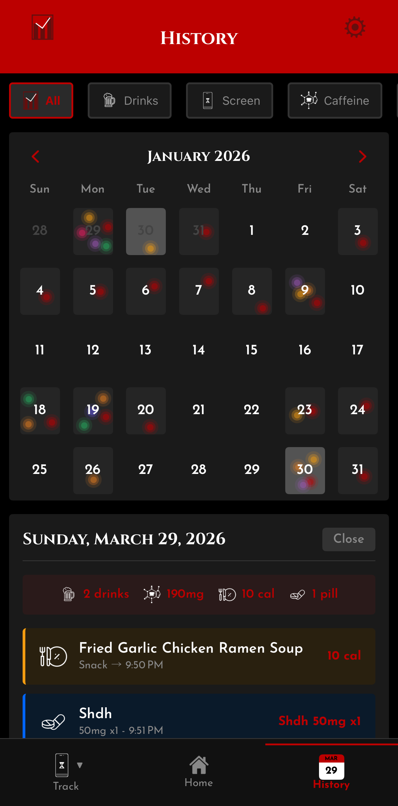

  

  

 

  &nbsp;
  &nbsp;
  

 

## About Me

I'm a **Senior Executive Audio Visual Engineer**, and aspiring **Web Designer**, **Data Analyst**, and **App Developer** working from **Chicago, IL**. In the most recent months, I have been working at **The Aspen Group (TAG)**. On the side, I've been working on projects to ensure my sanity, and they are becoming more fun for me. I am always willing to try new things and work with anyone and everyone.

 

## 🎵 Now Playing

<!-- LASTFM:START -->
| | Track | Artist | |
|:---:|:---|:---|:---:|
|  | [I’m Going to Heaven](https://www.last.fm/music/Amigo+The+Devil/_/I%E2%80%99m+Going+to+Heaven) | *Amigo The Devil* |  |
|  | [Weigh Me Down](https://www.last.fm/music/Lorn/_/Weigh+Me+Down) | *Lorn* |  |
|  | [PERFEKT DARK](https://www.last.fm/music/Lorn/_/PERFEKT+DARK) | *Lorn* |  |
|  | [Diamond](https://www.last.fm/music/Lorn/_/Diamond) | *Lorn* |  |
|  | [ANVIL](https://www.last.fm/music/Lorn/_/ANVIL) | *Lorn* |  |
<!-- LASTFM:END -->

 

  <picture>
    <source media="(prefers-color-scheme: dark)" srcset="./profile-3d-contrib/profile-night-green.svg" />
    <source media="(prefers-color-scheme: light)" srcset="./profile-3d-contrib/profile-green.svg" />
    
  </picture>

 

##  Cipher Tracker

> *"Master Your Habits. Secure Your Life."*

 

  &nbsp;&nbsp;&nbsp;
  &nbsp;&nbsp;&nbsp;
  

 

| | |
|:---|:---|
| **Platform** | iOS (TestFlight Beta) — Android coming soon |
| **Stack** | React Native, Expo, TypeScript, Firebase |
| **Encryption** | AES-256-CTR — not even we can read your data |
| **Trackers** | Alcohol, Caffeine, Cannabis, Nicotine, Sleep, Calories, Hydration, Pills, Period, Exercise, Screen Time, Diary |
| **Integrations** | FatSecret API, Barcode Scanning, RevenueCat Subscriptions |
| **Website** | Next.js + TypeScript + Tailwind CSS + Framer Motion |

 

  &nbsp;
  

 

## Tech Stack

<h4 align="center">Frontend</h4>

<h4 align="center">Backend & Tools</h4>

<h4 align="center">Security & Encryption</h4>

<h4 align="center">AV Systems</h4>

 

## GitHub Stats

  
  &nbsp;&nbsp;
  

 

  

 

  

 

  <picture>
    <source media="(prefers-color-scheme: dark)" srcset="https://raw.githubusercontent.com/jgeddes3/jgeddes3/output/github-snake-dark.svg" />
    <source media="(prefers-color-scheme: light)" srcset="https://raw.githubusercontent.com/jgeddes3/jgeddes3/output/github-snake.svg" />
    
  </picture>

 

*"Privacy is not about having something to hide. Privacy is about having something to protect."*

 

  

